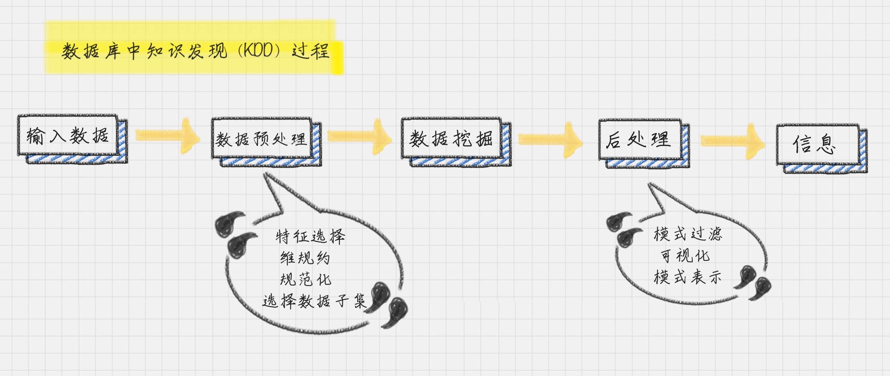

# 数据分析需要掌握的概念

## 由Apriori算法引入
- 商品捆绑销售：
    - 洗发水和沐浴露
    - 啤酒和纸尿裤


## 商业智能BI、数据仓库DW、数据挖掘DM之间的关系
- 商业智能（Business Intelligence）：商店利用数据预测用户的购物行为属于商业智能（是得到商业价值的过程）
- 数据仓库（Data Warehouse）：商店积累顾客的消费习惯存储在数据仓库（金矿）
    - 数据仓库是数据库升级的概念，数据仓库的数据量更大；数据库是一项技术。    
- 数据挖掘（Data Mining）：通过对个体消费行为进行的分析总结出来的规律属于数据挖掘（炼金术）
    - 核心：分类、聚类、预测、关联分析
    - 目的：得到商业报告（黄金）
    - 基础：地基DW+搬运工ETL+科学家DM => 商业报告

## 元数据VS数据元
- 元数据（MetaData）：描述其他数据的数据，也称"中介数据"。
    - 如：图书（书名、作者、出版社、ISBN、出版时间、页数、定价）这**多个属性**就是一套图书的**元数据**
    - 元数据可以很方便应用于定义数据仓库中的数据与数据之间复杂的关系
    - 刻画数据的抽取和装换规则
    - 存储与数据仓库主题有关的各种信息
    - 整个数据仓库的运行都是基于元数据的：抽取调度数据、获取历史数据。
- 数据元（Data Element）： 就是最小数据单元，例如书的：书名、作者、出版社等信息
    - 好处：使信息的描述和分类实现了结构化，机器处理方便。

## 数据挖掘的流程
- 数据挖掘（Knowledge Discovery in Database,简称KDD），数据库中的知识发现。
### 分类、聚类、预测和关联分析
- 1、分类
    - 通过训练集得到一个**分类模型**，然后用这个模型可以对其他数据进行分类。
    - 数据：1、训练集；2、测试集
        - 训练集：用来给机器做训练的，通常是人们整理好训练数据，以及这些数据对应的分类标识===>
        通过训练，机器就会产生**自我分类模型**==>对测试集中的数据进行分类预测。
        - 测试集：人们已知测试结果==>比对测试结果并进行验证==>了解分类器在测试环境的表现。
- 2、聚类
    - 将数据自动聚类成为几个类别，聚到一起的相似度大，不在一起的差异性大
    - 采用聚类对数据划分

- 3、预测
    - 通过当前和历史数据来预测未来的趋势==>识别机遇和风险
- 4、关联分析
    - 发现数据中的关联规则：广泛应用在购物篮分析或者事务数据分析中，如商品的例子。
    
## 数据挖掘的步骤
-  数据库中知识发现(KDD)过程
```markdown
输入数据--->数据预处理--->数据挖掘--->后处理--->信息
             /|\                   /|\
            特征选择               模式过滤
            维规约                 可视化
            规范化                 模式表示
            选择数据子集
```


### 数据预处理
- 1、数据清洗
    - 去除重复数据，去掉噪音（即干扰数据）以及填充缺失值
- 2、数据集成
    - 将多个数据源中的数据存放在一个统一的数据存储中。
- 3、数据变换
    - 将数据转换成为合适数据挖掘的形式。
        - 如**归一化**:将属性数据按照比例缩放，这样可以将数值落入一个特定的区间内：0~1之间。

### 数据后处理
- 将模型预测的结果进一步处理之后，再导出。
    - 比如在二分类问题中，一般能够得到0~1之间的概率值，此时把数据以0.5为界限进行四舍五入就可以实现后处理。

## 白话数据挖掘概念（追女孩）
- 商业智能：追那个？成功率多大？
- 数据仓库：有两女孩的信息存储着
- 数据元：女孩的年龄、生日、电话等属性
- 元数据：女孩的总的属性加起来
- 数据挖掘：帮你决策追那个女孩
- 分类算法：女孩属于那个分类：御姐、女王、萝莉
- 聚类算法: 女孩如果太多，分群组聚类，再抉择
- 关联分析算法：女孩闺蜜是谁呢
- 数据清洗：原来这两个女孩是同一个人，去重
- 数据集成：去重之后，变成一个女孩
- 数据变换：公斤和斤转换成为克单位

## 总结
- 神不会告诉我们规律，需要数据挖掘
    - 如：用电火花打点计时器的纸带实验求取自由落体及速度
    - 如：电商智能推荐算法

## 课后练习题

1.A 2.A
3、数据挖掘可以帮我们进行抉择，也可以应用到人工智能上，让机器帮我们做事情，特别是在5G时代，数据挖掘将大放异彩。

    


    


