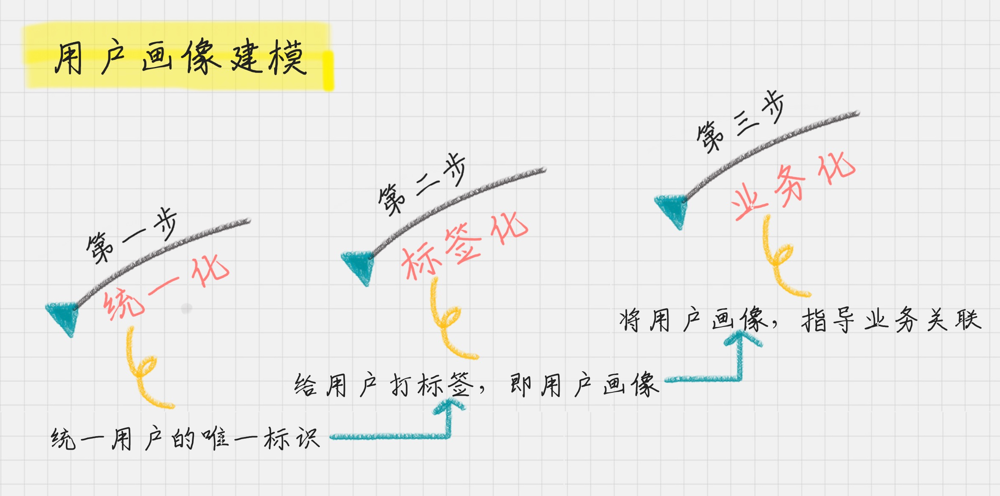

# 用户画像：标签化就是数据的抽象能力

## 用户画像准则
- 用户："都是谁"，"从哪来"，"要去哪"。
- 第一步：统一化，统一用户的唯一标识
- 第二步：标签化，给用户打标签，即用户画像
- 第三步：业务化，将用户画像，指导业务关联

### 首先为什么要设计唯一的标识？
- 用户唯一的标识是整个用户画像的核心，我们使用这个核心区将用户的数据串联起来，这样才能更好跟踪和分析一个用户的特征。
- 设计唯一的标识可以选：用户名，注册手机号码，联系人手机号，邮箱，设备号，CookieID等。
### 其次，给用户打标签（用户的数学建模）
怎样给用户打标签：八字口诀：**用户消费行为分析**
- 1、用户标签：性别，年龄，地域，收入，学历，职业等，这些包括了用户的基本属性
- 2、消费标签：消费习惯、购买意向、是否对促销敏感。这些统计分析用户的习惯。
- 3、行为标签：时间段，频次，时长，访问路径。这些是通过分析用户的行为，来得到其使用APP的习惯。
- 4、内容分析：对用户平时浏览的内容，尤其是停留时间的长，浏览次数多的内容进行分析，分析出用户对那些内容感兴趣（金融，娱乐，教育，体育，时尚，科技等）

从用户生命周期的三个阶段来划分业务价值，包括：**获客，粘客，留客**
- 1、获客：如何进行拉新，通过更加精准的营销获取客户。
- 2、粘客：个性化推荐，搜索排序，场景运营等。
- 3、留客：流失率预测，分析关键节点降低流失率。

按照数据流处理的阶段来划分用户画像建模的过程，可以分为数据层，算法层和业务层
- **数据层：** 指的是用户消费行为里面的标签。我们可以打上“事实标签”，作为数据客观的记录。
- **算法层：** 指的是透过这些行为的用户建模。我们可以打上“模型标签”，作为用户画像分类的标识。
- **业务层：** 指的是获客，粘客，留客的手段。我们可以打上“预测标签”，作为业务关联的结果。

所以这个标签化的流程，就是通过数据层的“事实标签”，在算法层进行计算，打上“模型标签”的分类结果，最后指导就业层，得出“预测标签”。

数据层 ——>算法层——>业务层

 

## 美团外卖的用户画像该如何设计？
1、用户登录方式分析：手机号、微信、微博、美团账号。

2、在最开始的顶层框架上，将用户标识进行统一，为后续过程中实现打通用户数据做准备。如手机号。

3、有了用户，按照八字口诀**用户消费行为分析**准则来进行分析。

- 1、用户标签：性别，年龄，家乡，居住地，收货地址，婚姻，宝宝信息，通过何种渠道进行注册。
- 2、消费标签：餐饮口味、消费均价、团购等级、预定使用等级、排队使用等级、外卖等级。
- 3、行为标签:点外卖时间段、使用频次、平均点餐用时、访问路径。
- 4、内容分析：基于用户平时浏览的内容进行统计，包括餐饮口味、优惠敏感度等

4、有了**用户消费行为分析**之后，可以理解业务了。

- 一个经常吃沙拉的人，一般很少吃宵夜
- 一个经常吃宵夜的人，小龙虾消费一般比别人高。
5、因此，基于标签产生的价值有：
- **在获客上：** 使用优势的宣传渠道，通过个性化的宣传手段，吸引有潜在需求的用户，并刺激其转化。
- **在粘客上：** 提升用户的单价和消费频次。个性化推荐，重复购买，通过红包、优惠等方式刺激对优惠敏感的人群，提升购买频次。
- **在留客上：** 预测用户是否会从平台上流失。用户流失包括的情况有：用户体验、竞争对手、需求变化等，通过预测用户的流失率可以大幅度降低用户留存的运营成本。

## 锻炼自己的抽象能力，将繁杂的事务简单化
**我们的最终目的不是处理这些数据，而是理解、使用这些数据挖掘的结果。** 对数据的标签化能让我们快速理解一个用户，一件商品，乃至一个视频内容分的特征，从而方便我们去理解和使用数据。

对数据的标签化其实考验的是我们的抽象能力，在日常的生活中，我们也要锻炼自己的抽象能力，它可以让我们很快的将一个繁杂的事物简单化，不仅方便理解，还有益于后续使用。

## 课后习题：
羊肉串店的用户画像分析：
- 用户标签：性别，年龄，家乡，居住地
- 消费标签：羊肉串口味，平均消费多少钱，是否经常使用优惠券
- 行为标签：什么时候吃羊肉串，多久吃一次，决定吃羊肉串用时，怎样吃到羊肉串的
- 内容标签：经常吃什么口味的，浏览很久又不吃的，优惠券敏感度

微信朋友群标签：家人、朋友、同时、领导、老师、陌生人。
- 用户标签：性别，年龄，地域，家乡
- 消费标签：发票圈的类型，平均多久发一次
- 行为标签：什么时候发，多久发一次，发票圈用时，使用什么手机发，点赞行为
- 内容标签：经常发什么类型，点赞什么内容
